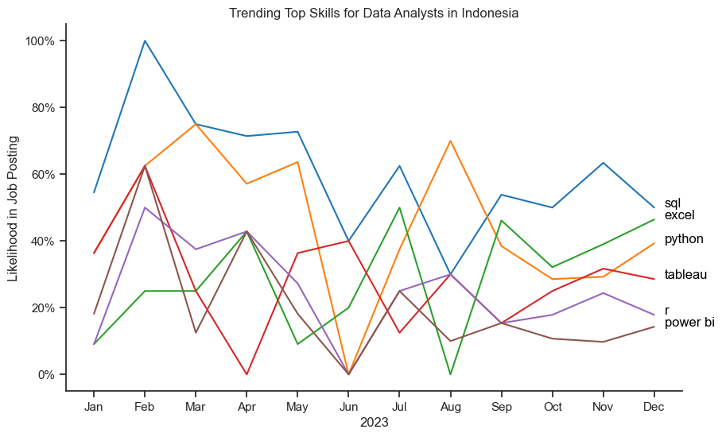

# The Analysis
## 1. What are the most used skills for the 3 most popular data roles in Indonesia?
To find the most used skills for the top 3 most popular data roles. I filtered out those positions by which ones were the most popular, and got the top 6 skills for these top 3 roles. This query highlights the most popular job titles and their top skills. 

View in the notebook with detailed information here ->  [Most Used Skill](2_Skill_Demand.ipynb)

### Visualize Data
```python
fig, ax = plt.subplots(len(job_titles), 1, figsize=(9, 6))

for i, job_title in enumerate(job_titles):
    df_plot = df_skills_perc[df_skills_perc['job_title_short'] == job_title].head(6)
    sns.barplot(
        data=df_plot, 
        x='skill_percent', 
        y='job_skills', 
        ax=ax[i], 
        hue='skill_count', 
        palette='dark:b_r'
    )

plt.show()
```

### Results


### Insight
- SQL and Python Dominance: SQL and Python are the most commonly requested skills across all three roles. SQL is particularly prominent for Data Analysts (49%) and Data Engineers (57%), while Python leads for Data Scientists (53%).

- Role-Specific Skill Preferences: There are distinct differences in the skills required for each role. Data Analysts are also expected to know Excel (31%) and Tableau (25%), while Data Engineers are expected to be proficient in Spark (23%), AWS (22%), and Hadoop (20%). For Data Scientists, R (35%) is the third most requested skill after Python and SQL, with Tableau (17%) and Spark (14%) also being significant.

- Visualization and Big Data Tools: Visualization tools like Tableau and Power BI are more relevant for Data Analysts, while big data technologies such as Spark, AWS, and Hadoop are more pertinent for Data Engineers. Data Scientists have a balanced demand for a mix of analytical and data manipulation tools, including R and Hadoop, besides Python and SQL.


## 2. What are the skill trends required to become a Data Analyst in Indonesia?
To find out how skills are trending in 2023 for Data Analysts in Indonesia, I filtered data analyst positions and categorized the skills by month of job posting. This led me to the top 6 data analyst skills by month, showing how popular they will be in 2023.

View in the notebook with detailed information here ->  [Trending Skill](3_Skill_Trend.ipynb)

### Visualize Data
```python
from matplotlib.ticker import PercentFormatter

df_plot = df_DA_INA_percent.iloc[:, :6]
plt.figure(figsize=(10, 6))
sns.lineplot(
    data=df_plot,
    dashes=False,
    palette='tab10'
)

plt.gca().yaxis.set_major_formatter(PercentFormatter(decimals=0))

for i in range(6):
    plt.text(11.2, df_plot.iloc[-1, i], df_plot.columns[i], color='black')

    
plt.show()
```

### Results


### Insight
- Dominance of SQL and Excel: SQL consistently appears as the most sought-after skill, with its prevalence peaking around February and remaining relatively high for the rest of the year. Excel also shows strong demand, particularly towards the latter half of the year, indicating that foundational data management and analysis skills are highly valued in the job market.

- Fluctuating Popularity of Python and Tableau: Python and Tableau demonstrate significant fluctuations in demand. Python experiences a notable dip around June but recovers towards the end of the year, reflecting varying emphasis on programming and data visualization skills across different periods. Similarly, Tableau sees a steep decline mid-year but picks up again, suggesting intermittent but recurring needs for specialized data visualization expertise.

- R and Power BI as Niche Skills: Both R and Power BI maintain a lower but steady presence compared to other skills. Their demand never exceeds 40%, indicating that while they are important, they are not as frequently required as SQL, Excel, Python, or Tableau. This trend suggests that R and Power BI are considered more niche or supplementary skills in the Indonesian data analyst job market.


## *Data Source :
[Data Source](https://huggingface.co/datasets/lukebarousse/data_jobs) 